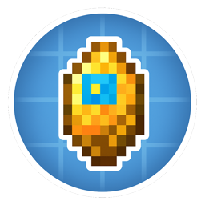

<p align="center"></p>
<h1 align="center">Create: Originium Industry</h1>
<p align="center">机械动力：源石工业</p>

<div align="center">
    <a href="https://github.com/zack-zzq/Create-Originium-Industry/actions/workflows/build.yml"></a>
    <a href="https://github.com/zack-zzq/Create-Originium-Industry/releases"></a>
    <a href="LICENSE"></a>
    <a href="https://www.curseforge.com/minecraft/mc-mods/create-originium-industry"></a>
    <a href="https://modrinth.com/mod/create-originium-industry"></a>
</div>

A [Create](https://github.com/Creators-of-Create/Create) addon about a new industrial ore — Originium. Gameplay is **inspired by** Arknights; assets, names, and systems in this repository are original.

v1 is a closed loop, not a pile of extra materials: **dust pollution → purification → reactor**.

⚠ Still **WIP**. Survival is not complete (no worldgen, no purest-originium line, no reactor).

## Requirements

- Minecraft **1.21.1**
- NeoForge **21.1.x**
- Create **6.0.4+**

## v1 pillar

Players mine and process Originium with Create machines. Processing pollutes the surrounding chunks with originium dust. Dust spreads, makes players sick, and can become lasting infection. Filters and (later) protection make factories livable. A cleaner, more expensive **purest** line feeds a late-game **reactor** that is powerful and unstable.

Two industrial routes:

1. **Alloy route** — molten originium + iron → originium alloy ingot (safer structural material).
2. **Purest route** — not in-game yet. Planned: filter / purify molten originium, then culture solution (培养液) + supercooling → purest originium (hotter fuel, nastier failure).

## What's in this version (`0.0.8-dev`)

### Items

| Id | English | 中文 |
|---|---|---|
| `raw_originium` | Raw Originium | 粗制源石 |
| `originium_shard` | Originium Shard | 源石碎片 |
| `originium` | Originium | 源石 |
| `originium_dust` | Originium Dust | 源石尘 |
| `originium_alloy_ingot` | Originium Alloy Ingot | 源石合金锭 |
| `purest_originium` | Purest Originium | 至纯源石 (no recipe yet) |
| `originium_dust_sieve` | Originium Dust Sieve | 源石尘滤网 |
| `originium_dust_nozzle` | Originium Dust Nozzle | 源石尘分散滤网 (placeholder) |
| `originium_debug_wand` | Originium Debug Wand | 源石调试器 (creative / OP) |

### Fluids

| Id | English | 中文 |
|---|---|---|
| `molten_originium` | Molten Originium | 熔融源石 |
| `purest_molten_originium` | Purest Molten Originium | 至纯熔融源石 (no recipe yet) |
| `originium_catalyst` | Originium Catalyst | **培养液** (id stays `originium_catalyst`) |

### Processing (Create)

```
raw originium
  ├─ milling / crushing → originium shards
  └─ (heated mix 4 shards) → originium
        └─ superheated mix → molten originium
              └─ mix with iron → originium alloy ingot

redstone + sugar + lapis + water (heated mix) → originium catalyst (培养液)
```

### Systems (in progress)

- Per-chunk originium dust, diffusion, and decay (overworld)
- Create mill / crush / mix hooks that emit dust via `IOridustProducer` (datapack `coi_dust_emission` JSON; config overrides frozen recipe ids). Heated shard mix and superheated melt emit more than cold milling; `catalyst_mixing` is heated but ships amount 0 (no originium feedstock). No furnace/fan recipes.
- Player exposure, infection, and Originium Exposure Sickness
- Kinetic dust filter implements shared `IDustPurifier` (chunk absorb, nearby emission capture, `originium_dust` byproduct with remainder buffer — no dup/void)
- Common + client config (`create_originium_industry-common.toml` / `-client.toml`): dust, exposure, filter, protection hooks, reactor stubs, dedicated-server spread policy, accessibility
- `/coi_debug` and the debug wand for inspection

Dust and pollution are being reworked. Treat `core/oridust` as unstable; **do not rename registry ids** — see [docs/REGISTRY.md](docs/REGISTRY.md).

## Roadmap

| Phase | Name | Status |
|---|---|---|
| **M0** | Tech cleanup: freeze ids, docs, metadata, config skeleton | Done |
| **M1** | Dust loop MVP: data-driven emission, filters, dust meter, survival source | In progress (simulation refactor) |
| **M2** | Purest / alloy expansion: filter + 培养液 + supercooling | Not started (items/fluids exist) |
| **M3** | Reactor: heat, cooling, instability / meltdown | Stub only (`/coi_debug reactor`) |
| **M4** | Ponder, GameTests, optional compat (e.g. Create: Aeronautics) | Not started |

M1 must be playable before M3. The reactor depends on dust APIs and the purest fuel chain.

## Documentation for contributors

- [Registry, lang keys, and save compatibility](docs/REGISTRY.md) — what must not be renamed
- Issues: [github.com/zack-zzq/Create-Originium-Industry/issues](https://github.com/zack-zzq/Create-Originium-Industry/issues)

## Inspiration and copyright

This project is **inspired by** Arknights (Hypergryph / Gryphline) and is **not** affiliated with or endorsed by them.

We do **not** distribute:

- Official character art, logos, or UI
- Long passages of official story text
- Official audio, models, or other copyrighted assets

Item names such as Originium are used as original gameplay terms in a Create industrial setting. Code and original textures in this repository are MIT; that license does **not** grant rights to third-party IP.

If you contribute art or text, keep it original.

## License

[MIT](LICENSE). Authors: Zack Zhu, Mimei.
